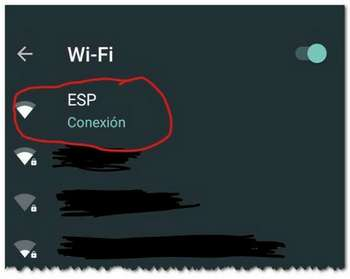
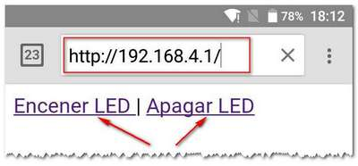
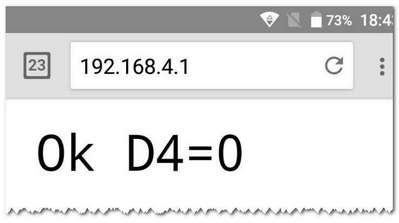
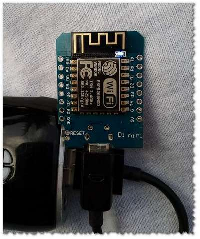

# HTTP_Control

Borja HTTP_Control
Bueno hace unos dias Recibi una llamada de un amigo con una idea de un proyecto
Para sus Alumnos.

La Idea es controlar un Arduino por peticiones HTTP
Para luego integrarlo en algo MAS GRANDE
(esto ya es su parte y de momento no se puede contar.)

# Manejo:

## 1) Conectarnos a la red wifi creada por el ESP8266
Una Vez Encendido el ESP8266 aparecera una red WIFI llamada ESP


## 2) Abrir el navegador y teclear la siguiente direccion: **http.//192.168.4.1**


## 3) Pulsar en el enlace de encender/apagar led.
el led deberia responder.






# Explicacion:

## 1) El programa crea una RED WIFI llamada ESP
```c
WiFi.mode(WIFI_AP);
WiFi.softAP("ESP");
```

## 2) Despues Arranca un servidor web con 3 paginas.
```c
servidor_web.on("/LedOn" , D4a0 );//en la placa WEMOS d1 mini 
servidor_web.on("/LedOff" , D4a1 );// el led se enciende al poner D4 a 0
servidor_web.on("/" , pag_principal);
servidor_web.begin();

```

## 3) Muestra via serie la Direccion (esto es informativo)
```c
Serial.println("\n\n Iniciando Red WIFI ESP... ");
Serial.println(" http://192.168.4.1 ");
```

## 4) El truco esta en la combinacion de las funciones y las paginas del servidor.
```c
servidor_web.on("/LedOn" , D4a0 );
```

Quiere decir que al abrir la direccion http://192.168.4.1/LedOn
se lanzara una llamada a la funcion __D4a0()__ 
que encendera el led.
( en la placa Wemos D1 el led se enciende al poner D4 a 0 )
```c
void D4a0() {
  pinMode(D4, OUTPUT);
  digitalWrite(D4, 0);
  servidor_web.send(200, "text/plain", "Ok D4=0");
}
```

En esta funcion Enciendo el LED poniendo el pin D4 a 0.
```c
pinMode(D4, OUTPUT);
digitalWrite(D4, 0);
```

Y muesto resultado.
```c
servidor_web.send(200, "text/plain", "Ok D4=0");
```

### En la proxima revision añadire:
- que se pueda conectar a un wifi
- que se pueda leer una patilla analogica (A0)
Asi el programa deberia ser totalmente funcional.
Aqui esta la explicacion:[HTTP_Control2](README2.md)
