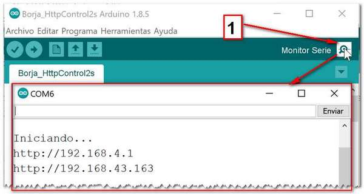
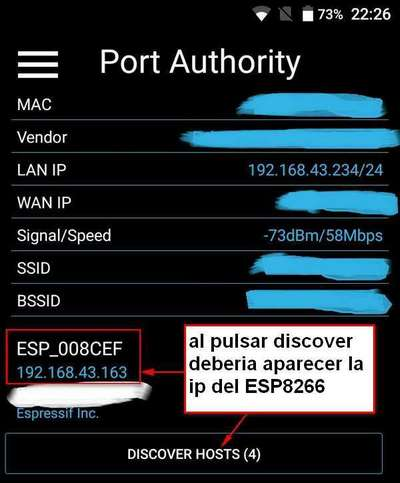
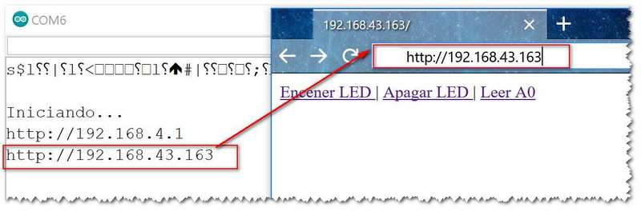
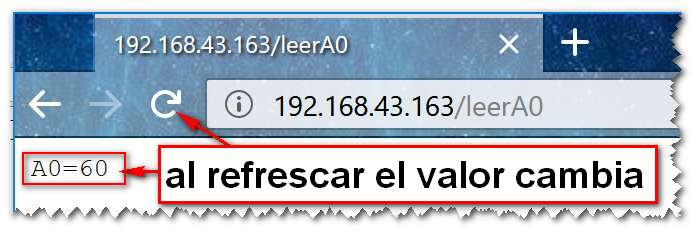

# Continuando con HTTP_control
Esta vez añado Conexion a una red wifi existente y lectura del Pin A0.

## Manejo:

## 1) Conectar el ESP al USB del PC y abrir terminal serie del arduino para ver la IP que obtiene al conctarse al WIFI



### 1b) O Con el movil y el programa libre **Port Autority** (por ejemplo) ver la IP que obtiene el ESP al conectarse al wifi. 



## 2) Con el ordenador o el movil conectado al mismo wifi 
poner en el navegador la IP indcada en el terminal.



## 3) Esta vez si pulsamos en leer A0 
al refrescar la pagina veremos com el valor cambia al tocar el pin A0 con el dedo.
(al ser un entrada analogica es bastante sensible)



# Explicacion:

## 1) El programa se conecta a una red wifi llamada Mi_Red_WIFI (cambiar por el nombre de la red wifi a la que nos queremos conectar)
```c
char* Red_WIFI = "Mi_Red_WIFI";
char* password_WIFI = "Mi_Contraseña_Wifi";
WiFi.mode(WIFI_AP_STA);
WiFi.softAP("ESP");
WiFi.begin(Red_WIFI, password_WIFI);
```
he cambiado WIFI_AP por WIFI_AP_STA 

(AP = punto de acceso) (STA de estacion)

he añadido WiFi.begin(Red_WIFI, password_WIFI);

Para que se conecte a la red WIFI

## 2) Pasados 5 segundos muestro la ip obtenida WiFi.localIP()
```c
delay(5000); //tiempo para que conecte al WIFI
Serial.print("http://"); 
Serial.println(WiFi.localIP().toString());
```
